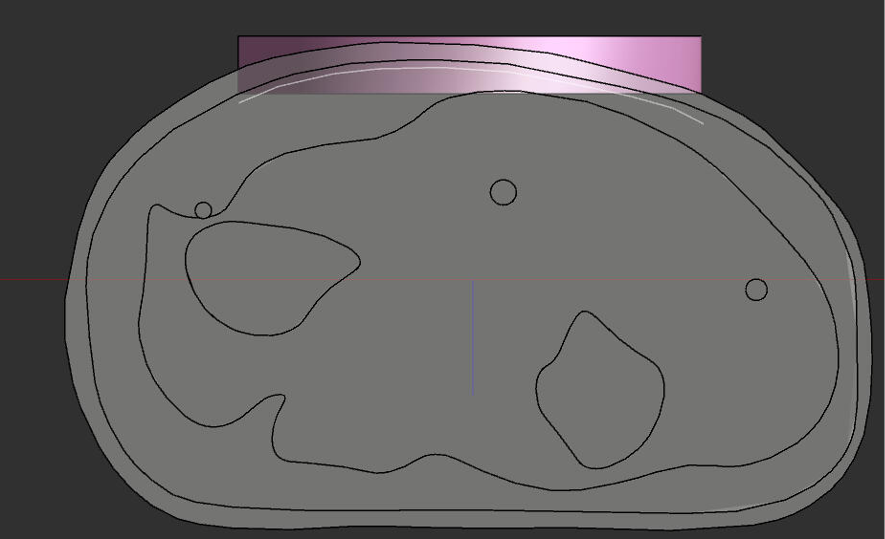

# The Comfort of Temporal Interference Stimulation on the Forearm: Computational and Psychophysical Evaluation
This a repository for codes used to run the simulations outlined in the paper 'The Comfort of Temporal Interference Stimulation on the Forearm: Computational and Psychophysical Evaluation'. For further information, please refer to the paper. 

## Important Notes
Please note that this code was written to be used with Sim4life light V7.2 (desktop). As of the last test (Aug 2024), the code was compatible with the latest S4L Lite web version. 

The 3D models are generated based on MRIs from Schimmoeller et al.'s paper (citation below).

*Tyler Schimmoeller, Erica E. Neumann,Tammy M. Owings, Tara F. Nagle, Robb W. Colbrunn, Benjamin Landis, J. Eric Jelovsek, Tod Hing, Joy P. Ku, and Ahmet Erdemir. Reference data on in vitro anatomy and indentation response of tissue layers of musculoskeletal extremities. Scientific Data 2020 7:1, 7(1):1–10, 1 2020. ISSN 2052-4463. doi: 10.1038/s41597-020-0358-1. URL https://www.nature.com/articles/s41597-020-0358-1*

## Instructions 
The steps below provide an overview of how the code works. 

### 1. Create a new project

Start by creating a new blank project in sim4life. The github repository could be linked to that account. 

### 2. Import arm simplified model
This step uploads the arm model and sets up the 
- Upload the .step file. Please see Figure 2 in the paper for what to expect.
- Rename the different body parts to match the following:'Skin','SAT','Muscle','Radius','Ulna','Ulnar Nerve','Median Nerve','Superficial Radial Nerve'
- Rename the two electrode bodies: 'Gel 1' and 'Gel 2'. *Note: It does not matter that the gel is actually within the body, because the different priorities set before creating the voxels will deal with this (this is part of the python script)*
- You need to add the actual electrode as a surface on top of those gels. A way to do this is to hold on the **Gel 1** then click on Extract -> faces. This will generate a folder within the Model tree called "Extracted Faces". Select the one corresponding to the top of the electrode and rename it **'Electrode 1'**. Repeat the same for **Gel 2** to create **'Electrode 2'**
- Make sure all the names match exactly because that is required for the model to work. 

### 3. Populate median nerve with axons
This steps add axons to the median nerve, and create a neuron model for each. 
- Start with finding the location of the median nerve. To do that, click on the nerve within the GUI, then click on tools -> geometry. A window will pop up showing key geometry details, one of which is the bounding box corners. You can use this to find the centre of the nerve (along the cross-section). 
- Open the *scripter* (see S4L for documentation as this is slightly different between the desktop and web versions).
- load up **populate_nerve.py**. 
- Set the correct paths in lines 29 and 65, and set a suitable model name on line 37
- Update line 44 with the correct location of the centre of the nerve
- You are now ready to run the code.
- When it is done, a folder will be created called 'Median Axon Trajectories', which includes the different axons and neuron models. 
- Double check that they are placed correctly within the model. 

### 4. Add the nerve endings in the SAT/Skin
This step adds nerve endings that start in the SAT and protrude into the skin.

- The first step here is potentially the trickiest. Using the Spline tool (within sketch), draw a spline just below the interface between the SAT and Skin, as shown below. In this example, the spline is defined by 10 points. 

- load up **populate_nerve_endings.py**. 
- Update the paths and model name, similar to step 3
- You are now ready to run the code.
- When it is done, a folder will be created called 'Endings Axon Trajectories', which includes the different axons and neuron models. 
- Double check that they are placed correctly within the model. 

The model is now ready for the simulation.

### 5. Run the chosen simulation

You can run the simulation with varying carrier frequency (Threshold_carrier.py), beat frequency (Threshold_beat.py), or depth of modulation (Threshold_depth_mod). The three scripts are very similar, so the example below is for varying the carrier frequency. 

- Start with updating the file paths on lines 29, 39, 65
- Update the range of frequencies you want to test at in line 81 (I recommend you start with just one when testing), and the required beat frequency in line 82. 
- By default, this code will only run to get the threshold from one axon (see below). If you want to get the activation of the nerve endings or the rest of the axons within the median nerve, change *run_all_median* and *run_all_endings* to equal 1. This is done on lines 88 and 89. 
- By default this script gets the threshold of the largest median motor axon. You can change that to be the sensory axon by changing the value of **Nerve** from *'Median Nerve Motor Axon'* to *'Median Sensory Motor Axon'* on line 93. 
- That is all you need to run the code. Please be warned that it does take some time to run, even with the default settings. Turning on the additional options will result in run times of days, and is prone to crashing. 
- The results will be saved as hdf5.

### 6. Accessing the results
hdf5 files can be accessed using HDFView if you want to check the file structure. Scripts *Activation_threshold.ipynb* and *Comfort_metrics.ipynb* allow you to save selected data into a .mat file. This could be run outside sim4life. Python 3.8.10 was used. 

**Important note:** Do not forget to close the file after accessing it as it could get corrupted. I recommend keeping the a separate backup, given the time it takes for the simulation to run. 
